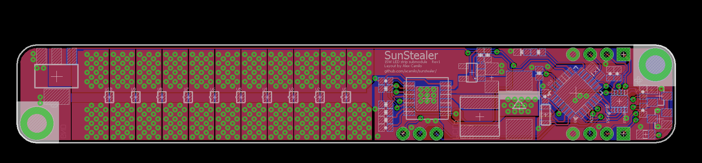

## SunStealer

Sunstealer is a 15 watt single color (rs485) networked LED strip built using a LT34781 driver and a PIC32MX110F016B. These strips are intended to be used to build larger LED panels with each strip covering a specific wavelength.

The goal is to be able to control the amount of light received by plants at each of these wavelengths and attempt to replicate some of the existing studies on type of light and it's affect on vegetative growth and fruiting.

There will be 5 variants of the strip each populated with LEDs targeting te following wavelengths (439,469,642,667,740) initially with the following ratios (1,1,2,2,1) This should make 1 105w LED light for hydro/aquaponics.

